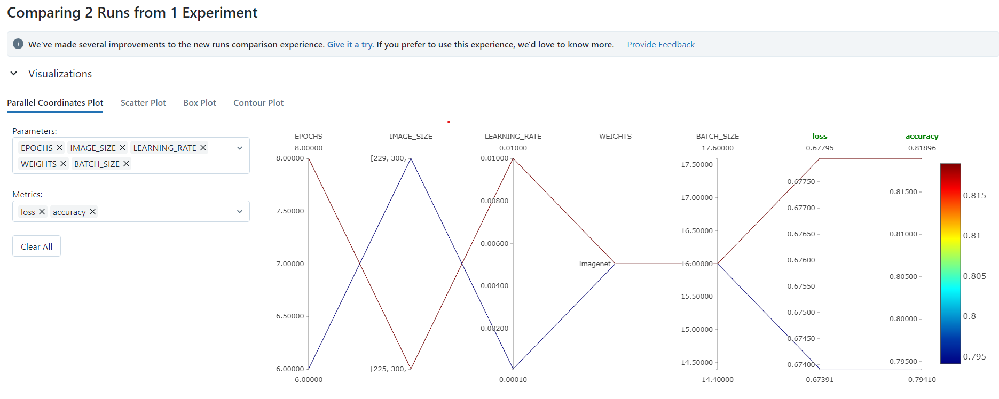
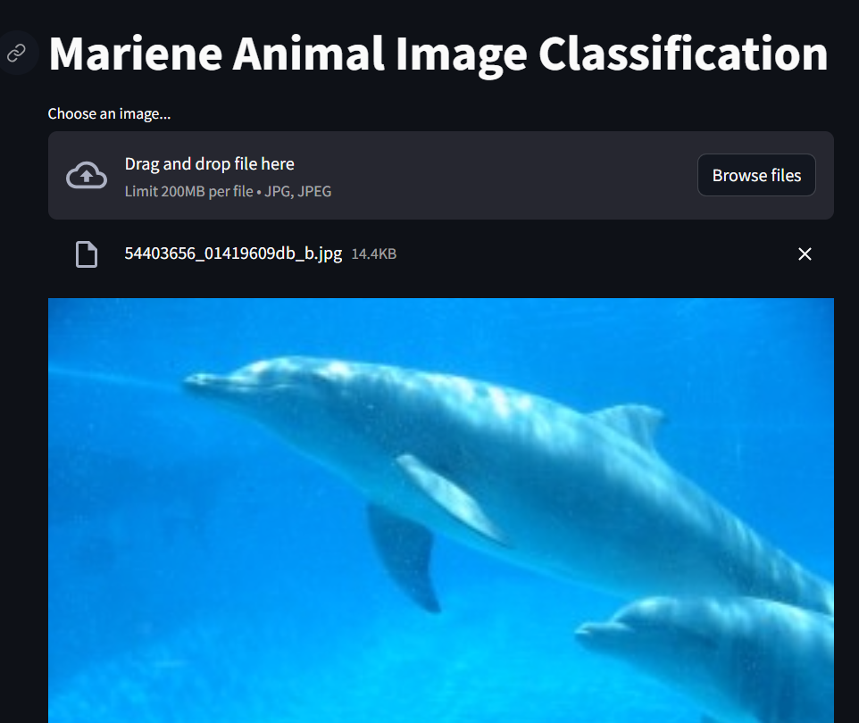
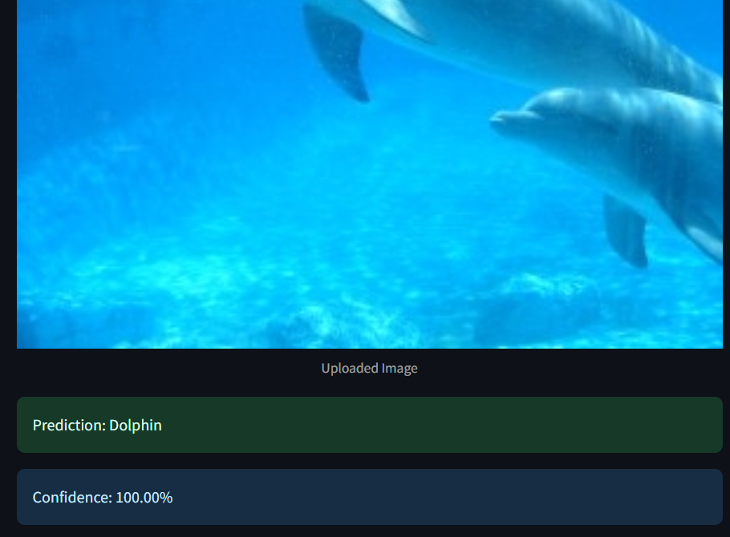

# under-water-animal-classification

## To Clone the Project on local machine Step 1
#### git clone {url}

## Requirements Step 2
#### pip install -r requirements.txt

## Main Step 3
#### python main.py

## Deployment part Step 4
### Streamlit
#### pip install streamlit
#### streamlit run sea.py

## Mlflow
### DagsHub
MLFLOW_TRACKING_URI=https://dagshub.com/ASHWIN492/under-water-animal-classification.mlflow \
MLFLOW_TRACKING_USERNAME=ASHWIN492 \
MLFLOW_TRACKING_PASSWORD=1055eec714afcdcbea6709267f829d12f5939166 \
python script.py

Run this to set as env variables :

set MLFLOW_TRACKING_URI= https://dagshub.com/ASHWIN492/under-water-animal-classification.mlflow

set MLFLOW_TRACKING_USERNAME=ASHWIN492

set MLFLOW_TRACKING_PASSWORD=1055eec714afcdcbea6709267f829d12f5939166

## Plotting of Hyperparameters and selecting the best parameters

## Working of model

